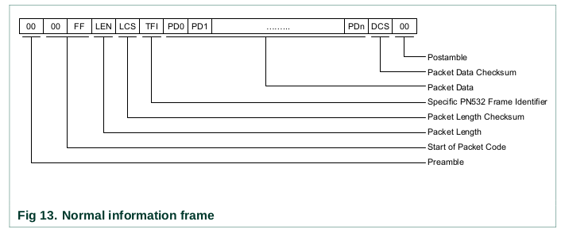
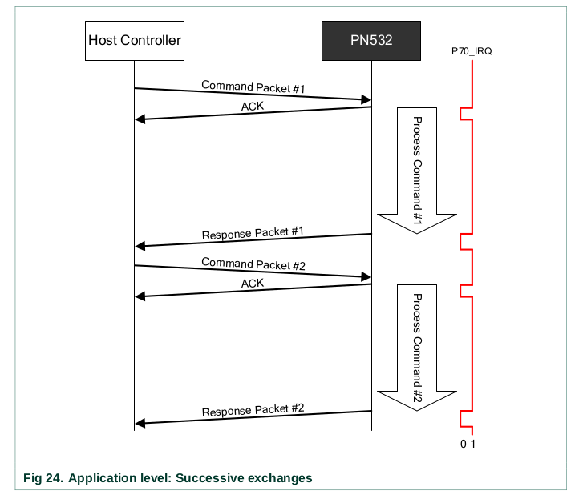

PN532 with Arduino : https://how2electronics.com/interfacing-pn532-nfc-rfid-module-with-arduino/#Difference_Between_RFID_038_NFC

A good tutorial of how to setup PN532 with Raspberry Pi : https://blog.stigok.com/2017/10/12/setting-up-a-pn532-nfc-module-on-a-raspberry-pi-using-i2c.html

```shell
i2cdetect -y 1
```

A nice tool to control spotify through the Web API (cli interface) : [spotify-cli](https://github.com/ledesmablt/spotify-cli).  
Example:
```shell
spotify play --uri spotify:album:5JY3b9cELQsoG7D5TJMOgw
spotify toggle
spotify next
```


TODOs :
 - étiquettes sur cassettes
 - use libnfc
 - interrupt PN532
 - WIFI rpi
 - understand how data content is refered to in ISO standards
 - lecture NFC plus rapide

## PN532 User Manual

These are my notes while reading the User Manual.

### Glossary

 - initiator : the PN532 is configured to be the reader
 - target : the PN532 is configured to be read as a card
 - host controller : the thing communicating with the PN532 (Arduino / Raspberry Pi / whatnot).

I2C address is 0x48 for write and 0x49 for read.

PICC emulation : the RFID protocol can go through the host controller rather than being handled by the PN532. Not very useful here.

Protocol :  
The host controller and the IC (integrated circuit) exchange frames.



There are normal frames, extended information frames (longer), ACK frame (successfully received previous frame), NACK frames (resend last frame) and ERROR frames.



### I2C

I2C's frames are a bit different. The PN532 responds with a RDY bit which is 0 when it is not ready, and 1 when it is ready to provide an answer. When it's one, the response is the following frame.

> When the host controller wants to read data from the PN532, it has to read first the status byte and as long as the RDY bit is not equal to 1, it has to retry

This is the basic protocol
> - COMMAND sent by the host controller,
> - The host controller polls the Status byte (using its own frequency),
> - ACK frame “sent” by the PN532,
> - Polling of the Status byte by the host controller ,
> - RESPONSE frame “sent” by the PN532,
> - Optional ACK sent by the host controller.

Another way is to use the interrupt pin to wait till a response is ready.
>In that case, the host controller can wait for this line to be asserted by the PN532 before to read the status byte. As a consequence, the overall traffic on the I2C bus is reduced.

Handshake : mecanism used to wake up either PN532 or host controller with interrupt when something happens.

SAM configuration : applies when using a SAM companion chip connected to the PN532 to bring security. Does not apply here.

### Commands

`Tg..` -> Target  
`In..` -> Initiator

The complete list of commands can be found at p65 in the User Manual (chapter 7 : Commands supported).

|Command|Code (CC)|
|--|--|
|GetFirmwareVersion|0x02|
|PowerDown|0x16|
|InListPassiveTarget|0x4A|
|InJumpForDEP|0x56|


DEP Protocol ???

## libnfc

Config : dans `/etc/nfc/libnfc.conf` ou `/usr/local/etc/nfc/libnfc.conf`

[Quelques détails pour l'installation](https://github.com/nfc-tools/libnfc/issues/534)

## FreeCAD

[Un bon tuto pour designer une boite de rpi](https://www.framboise314.fr/un-boitier-de-raspberry-pi-4-avec-freecad/)

## Power up / down

[Raspberry Pi Power-Up and Shutdown with a Physical Button](https://embeddedcomputing.com/technology/open-source/development-kits/raspberry-pi-power-up-and-shutdown-with-a-physical-button)

## Raspberry Pi setup

Disable random address: 
```shell
printf "[connection]\nwifi.mac-address-randomization=1\n\n[device]\nwifi.scan-rand-mac-address=no\n" | sudo tee /etc/NetworkManager/conf.d/100-disable-wifi-mac-randomization.conf
```
[Source](https://raspberrypi.stackexchange.com/questions/68513/pi-using-a-random-mac-address-after-every-reboot-how-do-i-stop-this-behavior)

## Spotify

[Setup de systemd](https://spotifyd.github.io/spotifyd/installation/Raspberry-Pi.html)
[Tuto de systemd](https://www.digitalocean.com/community/tutorials/understanding-systemd-units-and-unit-files)
[Repo de spotify cli](https://github.com/ledesmablt/spotify-cli)

## Funko Pop! figurines
 - AC/DC
 - Freddie Mercury
 - Green Day
 - Aerosmith
 - Kiss
 - Jimmy Hendrix
 - Beatles
 - The Police

# MPRIS
[dbus and python tutorial](https://amish.naidu.dev/blog/dbus/#mpris-spec)
[official spec](https://specifications.freedesktop.org/mpris-spec/latest/)
[spotifyd branch for system dbus](https://github.com/Spotifyd/spotifyd/issues/244)